# NHX KESY Backend Documentation

## Table of Contents

1.  [Introduction](#1-introduction)
    *   1.1. Project Overview
    *   1.2. Key Features
    *   1.3. Technologies Used
2.  [Architecture](#2-architecture)
    *   2.1. High-Level Architecture
    *   2.2. Core Modules
    *   2.3. Data Model (Database Schema)
    *   2.4. Exception Handling Flow
3.  [Setup and Development](#3-setup-and-development)
    *   3.1. Prerequisites
    *   3.2. Local Setup
    *   3.3. Configuration
    *   3.4. Running the Application
    *   3.5. Building the Project
4.  [API Reference](#4-api-reference)
    *   4.1. General API Information
    *   4.2. Authentication Endpoints
    *   4.3. User Endpoints
    *   4.4. KYC Endpoints
    *   4.5. Minting Endpoints
    *   4.6. Admin Endpoints
5.  [Security](#5-security)
    *   5.1. User Authentication (JWT)
    *   5.2. Role-Based Access Control (RBAC)
    *   5.3. Data Security
6.  [Deployment](#7-deployment)
    *   7.1. Docker Deployment
    *   7.2. Production Deployment Architecture
    *   7.3. Production Considerations
8.  [Support and Contact](#8-support-and-contact)

---

# NHX KESY Backend Documentation

## 1. Introduction

### 1.1. Project Overview

The NHX KESY is a Spring Boot application designed to manage core functionalities for a digital asset platform. It handles user authentication, Know Your Customer (KYC) processes, requests for minting KESY tokens, and administrative tasks. The backend provides a secure and scalable foundation for managing user interactions and digital asset operations.

### 1.2. Key Features

*   **User Authentication & Authorization:** Secure user registration, login, OTP (One-Time Password) verification, and JWT-based authentication with refresh tokens. It includes robust role-based authorization for administrative and other specific functionalities.
*   **KYC Management:** Implements a workflow for user identity verification, covering document submission by users and subsequent review by administrators.
*   **Minting Operations:** Provides functionality for users to initiate requests for minting KESY tokens, including necessary validations and tracking of mint request statuses.
*   **Centralized Exception Handling:** Features a consistent and robust error management system throughout the application, ensuring standardized JSON error responses with appropriate HTTP status codes for various error scenarios.
*   **Document Storage:** Integrates with Azure Blob Storage for cloud-based document management in production environments and utilizes local file storage for development/local profiles.
*   **Email Notifications:** Automates email communications for critical events such as OTP delivery, welcome messages, updates on KYC status, and changes in mint request statuses.
*   **Admin Dashboard (API):** Offers dedicated API endpoints for administrators to efficiently manage KYC submissions and oversee mint requests.

### 1.3. Technologies Used

The backend is built using the following key technologies:

*   **Spring Boot:** A powerful framework for developing production-ready, stand-alone Spring applications.
*   **Spring Data JPA:** Used for seamless interaction with relational databases and efficient repository management.
*   **Spring Security:** Provides comprehensive security services for authentication and authorization.
*   **H2 Database:** An in-memory database used primarily for local development and testing.
*   **Lombok:** A library that helps reduce boilerplate code, making the codebase cleaner and more concise.
*   **Swagger/OpenAPI:** Utilized for generating interactive API documentation, facilitating easy exploration and testing of endpoints.
*   **Azure Blob Storage SDK:** Enables integration with Azure Blob Storage for scalable cloud-based file storage.
*   **Thymeleaf:** A modern server-side Java template engine used for generating dynamic HTML content, particularly for email templates.
*   **Jackson:** A high-performance JSON processor used for serializing and deserializing Java objects to and from JSON.
*   **SLF4J & Logback:** Provides a robust and flexible logging framework for the application.
*   **Maven:** The primary project management and build automation tool.
*   **PostgreSQL:** Configured for persistent storage in production environments.

## 2. Architecture

### 2.1. High-Level Architecture

The NHX KESY backend follows a typical layered architecture for a Spring Boot application. It primarily serves client applications (frontend or other services) via HTTP/S requests.


**Components:**

*   **Controllers:** Handle incoming HTTP requests, route them to appropriate services, and return HTTP responses.
*   **Services:** Contain the core business logic, orchestrating operations and interacting with repositories and external integrations.
*   **Repositories:** Manage data persistence, abstracting database interactions (e.g., using Spring Data JPA).
*   **External Integrations:** Interface with third-party services or APIs.
*   **Email Service:** Manages sending email notifications.
*   **Storage Service:** Handles document storage, abstracting between Azure Blob Storage and local file system.
*   **Database:** Persistent storage for application data (H2 for dev/test, PostgreSQL for prod).
*   **SMTP Server:** Used for sending emails.
*   **Azure Blob Storage / Local File System:** Actual storage for documents.
*   **Authentication Manager & JwtTokenProvider:** Key components of the Spring Security setup for JWT-based authentication.
*   **GlobalExceptionHandler:** Centralized mechanism for handling exceptions across the application.

### 2.2. Core Modules

The application is structured into several Java packages, each responsible for a specific domain:

*   `config/`: Configuration classes for various services (Security, JWT, Email, Database).
*   `controller/`: REST controllers exposing API endpoints.
*   `exception/`: Custom exception classes and the global exception handler.
*   `model/`: Data Transfer Objects (DTOs), Entity classes for JPA, and Enums.
*   `repository/`: Spring Data JPA repositories for database access.
*   `security/`: Security-related classes, including JWT token generation and validation.
*   `service/`: Business logic layer for different features (Auth, KYC, Mint, User, Wallet).
*   `util/`: Utility classes for common functions.

### 2.3. Data Model (Database Schema)

The core entities in the database model include:


*Key entities include `USER`, `WALLET`, `KYC_DOCUMENT`, `MINT`, `REFRESH_TOKEN`, and `OTP`.*

### 2.4. Exception Handling Flow

The application implements a centralized exception handling mechanism using Spring's `@ControllerAdvice` and `@ExceptionHandler`. This ensures that all unhandled exceptions, whether custom or Spring-related, are caught and transformed into a consistent JSON error response.

```mermaid
graph TB
    A[👤 Client Request] --> B[🎯 Controller/Service Method]
B --> C{⚠️ Exception<br/>Occurs?}

subgraph handler ["🛡️ Spring Boot Exception Handling"]
C -->|Yes| D[🔴 GlobalExceptionHandler]

D -->|Custom| E[📝 Custom Exception<br/>Handler]
D -->|Validation| F[✅ Validation Error<br/>Handler]
D -->|Constraint| G[🔒 Constraint Violation<br/>Handler]
D -->|JSON| H[📄 Malformed JSON<br/>Handler]
D -->|Access| I[🚫 Access Denied<br/>Handler]
D -->|Fallback| J[⚙️ Generic Exception<br/>Handler]

E --> K[📊 Log Error]
F --> K
G --> K
H --> K
I --> K
J --> K

K --> L[🔧 Build Error Response]
L --> M[📦 Return Response Entity]
end

M --> N[✉️ Client Receives<br/>JSON Error]

style A fill:#e1f5ff,stroke:#01579b,stroke-width:3px,color:#000
style B fill:#fff9c4,stroke:#f57f17,stroke-width:3px,color:#000
style C fill:#ffe0b2,stroke:#e65100,stroke-width:3px,color:#000
style D fill:#ef5350,stroke:#b71c1c,stroke-width:4px,color:#fff
style E fill:#ffcdd2,stroke:#c62828,stroke-width:2px,color:#000
style F fill:#ffcdd2,stroke:#c62828,stroke-width:2px,color:#000
style G fill:#ffcdd2,stroke:#c62828,stroke-width:2px,color:#000
style H fill:#ffcdd2,stroke:#c62828,stroke-width:2px,color:#000
style I fill:#ffcdd2,stroke:#c62828,stroke-width:2px,color:#000
style J fill:#ffcdd2,stroke:#c62828,stroke-width:2px,color:#000
style K fill:#e8eaf6,stroke:#3f51b5,stroke-width:2px,color:#000
style L fill:#c5cae9,stroke:#3f51b5,stroke-width:2px,color:#000
style M fill:#9fa8da,stroke:#3f51b5,stroke-width:2px,color:#000
style N fill:#c8e6c9,stroke:#2e7d32,stroke-width:3px,color:#000
style handler fill:#fafafa,stroke:#616161,stroke-width:2px
```



**Example Error Response:**

```json
{
  "timestamp": "2023-10-27T10:30:00.123456",
  "status": 400,
  "error": "Bad Request",
  "message": "Invalid OTP",
  "path": "/api/auth/verify-otp"
}
```

## 3. Setup and Development

### 3.1. Prerequisites

Before setting up the application, ensure you have the following installed:

*   **Java Development Kit (JDK):** Version 21 or higher.
*   **Maven:** Version 3.8.x or higher.
*   **Git:** For cloning the repository.
*   **(Optional) Docker and Docker Compose:** For running local development services like PostgreSQL, MongoDB, and MailHog.

### 3.2. Local Setup

Follow these steps to get the application running on your local machine:

1.  **Clone the Repository:**

    ```bash
    git clone git@github.com:nhx-finance/nhx-kesy.git
    cd nhxkesy
    ```

2.  **Maven Dependencies:**
    All necessary dependencies are defined in the `pom.xml` file. Maven will automatically download them when you build the project.

3.  **Database Configuration:**
    The application defaults to an H2 in-memory database for `dev` and `local` profiles, suitable for development and testing without external database setup. Configuration details can be found in `src/main/resources/application-dev.yml`.

    For a more persistent local setup or production, you would configure PostgreSQL or another persistent database. A `docker-compose.yml` is provided for running PostgreSQL and MongoDB locally.

    If using Docker Compose for databases:

    ```bash
    docker-compose up -d postgres mailhog
    ```

4.  **Environment Variables / `application-dev.yml`:**
    Update `src/main/resources/application-dev.yml` with your local configurations. Key properties include:

    *   `spring.mail.*`: Configure your SMTP server details for sending emails (e.g., MailHog for local testing, or a real SMTP server).
    *   `jwt.access-token-expiry`, `jwt.refresh-token-expiry`: Set the expiry times for JWT access and refresh tokens.
    *   `app.base-url`, `app.name`, `app.support-email`: Application-specific details like base URL and support contact.
    *   `storage.local.base-path`: Specify the local directory for file storage when running with `dev`/`local` profiles. **Ensure this directory exists or the application has permissions to create it.**
    *   `admin.notification.email`: The email address for receiving admin notifications.

    **Example `application-dev.yml` snippet (relevant parts):**

    ```yaml
    # ... existing code ...
    spring:
      mail:
        host: localhost
        port: 1025
        # username: # For MailHog, username/password not typically needed
        # password: # For MailHog, username/password not typically needed
        properties:
          mail.smtp.auth: false
          mail.smtp.starttls.enable: false
    # ... existing code ...
    jwt:
      secret: YourSuperSecretKeyForJWTGenerationAndValidation # !!! CHANGE THIS IN PRODUCTION !!!
      access-token-expiry: 3600000 # 1 hour in milliseconds
      refresh-token-expiry: 604800000 # 7 days in milliseconds
    # ... existing code ...
    app:
      base-url: http://localhost:8080
      name: NHX KESY
      support-email: support@nhx.com
    # ... existing code ...
    storage:
      local:
        base-path: /tmp/nhx-kesy-uploads
    # ... existing code ...
    admin:
      notification:
        email: admin@nhx.com
    ```

### 3.3. Configuration Profiles

The application uses Spring Profiles to manage different configurations for various environments:

*   `dev`: Development environment (uses H2, local file storage, MailHog settings).
*   `prod`: Production environment (expects PostgreSQL, Azure Blob Storage, external SMTP).
*   `local`: Similar to `dev`, often used for specific local development needs.

Configure `application-prod.yml` with your production database (PostgreSQL), Azure Blob Storage, and external SMTP server details.

### 3.4. Running the Application

You can run the Spring Boot application using Maven:

```bash
mvn spring-boot:run -Dspring-boot.run.profiles=dev
```

Replace `dev` with `prod` or `local` if you have other profiles configured.

### 3.5. Building the Project

To build the executable JAR file:

```bash
mvn clean install
```

This will create a JAR file in the `target/` directory (e.g., `nhx-0.0.1-SNAPSHOT.jar`).

## 4. API Reference

The API endpoints can be explored via Swagger UI, which is configured to generate documentation automatically.

### 4.1. General API Information

*   **Base URL:** Typically `http://localhost:8080` (or your configured port).
*   **API Documentation:** Access the interactive Swagger UI at `http://localhost:8080/swagger-ui.html`. This provides a detailed list of all endpoints, their expected request/response formats, and allows for direct testing.

### 4.2. Authentication Endpoints

These endpoints handle user registration, login, and session management.

*   `POST /api/auth/signup`: User registration.
*   `POST /api/auth/login`: User login, returning JWT tokens.
*   `POST /api/auth/verify-otp`: Verify user email with OTP.
*   `POST /api/auth/refresh-token`: Obtain a new access token using a refresh token.

#### User Signup Flow

```mermaid
graph TB
subgraph signup ["📝 User Signup Flow"]
A1[👤 Client] -->|POST /api/auth/signup| B1[🎯 AuthController]
B1 --> C1[⚙️ AuthService]
C1 --> D1{📧 Email<br/>Exists?}
D1 -->|✅ Yes| E1[🚨 EmailAlreadyExistsException]
E1 --> X[🛡️ GlobalExceptionHandler]

D1 -->|❌ No| F1[👤 Create User]
F1 --> G1[(💾 UserRepository)]

C1 --> H1[🔐 OtpService]
H1 --> I1[🔑 Generate OTP]
I1 --> J1[(💾 OtpRepository)]

H1 --> K1[📧 EmailNotificationService]
K1 --> L1{✉️ Email<br/>Sent?}
L1 -->|❌ No| M1[🚨 OtpDeliveryException]
M1 --> X
L1 -->|✅ Yes| N1[📮 SMTP Server]
N1 --> O1[✅ Signup Complete]
O1 --> A1
end

style A1 fill:#e1f5ff,stroke:#01579b,stroke-width:3px,color:#000
style B1 fill:#f3e5f5,stroke:#6a1b9a,stroke-width:2px,color:#000
style C1 fill:#e8f5e9,stroke:#2e7d32,stroke-width:3px,color:#000
style D1 fill:#fff3e0,stroke:#e65100,stroke-width:3px,color:#000
style E1 fill:#ffcdd2,stroke:#c62828,stroke-width:2px,color:#000
style F1 fill:#c8e6c9,stroke:#388e3c,stroke-width:2px,color:#000
style G1 fill:#c5cae9,stroke:#283593,stroke-width:2px,color:#000
style H1 fill:#b2dfdb,stroke:#00695c,stroke-width:2px,color:#000
style I1 fill:#b2ebf2,stroke:#00838f,stroke-width:2px,color:#000
style J1 fill:#c5cae9,stroke:#283593,stroke-width:2px,color:#000
style K1 fill:#ffccbc,stroke:#d84315,stroke-width:2px,color:#000
style L1 fill:#fff3e0,stroke:#e65100,stroke-width:2px,color:#000
style M1 fill:#ffcdd2,stroke:#c62828,stroke-width:2px,color:#000
style N1 fill:#ff8a65,stroke:#bf360c,stroke-width:2px,color:#fff
style O1 fill:#a5d6a7,stroke:#2e7d32,stroke-width:3px,color:#000
style X fill:#ef5350,stroke:#b71c1c,stroke-width:4px,color:#fff
style signup fill:#f3e5f5,stroke:#6a1b9a,stroke-width:3px
```



#### OTP Verification Flow

```mermaid
graph TB
subgraph verify ["🔐 OTP Verification Flow"]
A2[👤 Client] -->|POST /api/auth/verify-otp| B2[🎯 AuthController]
B2 --> C2[⚙️ AuthService]
C2 --> D2[🔐 OtpService]
D2 --> E2[(💾 OtpRepository)]

D2 --> F2{🔑 OTP<br/>Valid?}
F2 -->|❌ No| G2[🚨 InvalidOtpException]
G2 --> X
F2 -->|✅ Yes| H2[✅ Mark OTP Used]
H2 --> E2

C2 --> I2[📝 Update User Status]
I2 --> J2[(👥 UserRepository)]

C2 --> K2[🎫 JwtTokenProvider]
K2 --> L2[🔑 Create JWT]
K2 --> M2[🔄 Create Refresh Token]
M2 --> N2[(💾 RefreshTokenRepository)]

K2 --> O2[✅ Return AuthResponse]
O2 --> A2
end

style A2 fill:#e1f5ff,stroke:#01579b,stroke-width:3px,color:#000
style B2 fill:#f3e5f5,stroke:#6a1b9a,stroke-width:2px,color:#000
style C2 fill:#e8f5e9,stroke:#2e7d32,stroke-width:3px,color:#000
style D2 fill:#b2dfdb,stroke:#00695c,stroke-width:2px,color:#000
style E2 fill:#c5cae9,stroke:#283593,stroke-width:2px,color:#000
style F2 fill:#fff3e0,stroke:#e65100,stroke-width:3px,color:#000
style G2 fill:#ffcdd2,stroke:#c62828,stroke-width:2px,color:#000
style H2 fill:#c8e6c9,stroke:#388e3c,stroke-width:2px,color:#000
style I2 fill:#fff9c4,stroke:#f57f17,stroke-width:2px,color:#000
style J2 fill:#c5cae9,stroke:#283593,stroke-width:2px,color:#000
style K2 fill:#b3e5fc,stroke:#0277bd,stroke-width:3px,color:#000
style L2 fill:#81d4fa,stroke:#0277bd,stroke-width:2px,color:#000
style M2 fill:#81d4fa,stroke:#0277bd,stroke-width:2px,color:#000
style N2 fill:#c5cae9,stroke:#283593,stroke-width:2px,color:#000
style O2 fill:#a5d6a7,stroke:#2e7d32,stroke-width:3px,color:#000
style X fill:#ef5350,stroke:#b71c1c,stroke-width:4px,color:#fff
style verify fill:#e8f5e9,stroke:#2e7d32,stroke-width:3px
```



#### User Login Flow

```mermaid
graph TB
subgraph login ["🔓 User Login Flow"]
A3[👤 Client] -->|POST /api/auth/login| B3[🎯 AuthController]
B3 --> C3[⚙️ AuthService]
C3 --> D3[🔐 AuthenticationManager]

D3 --> E3{✅ Credentials<br/>Valid?}
E3 -->|❌ No| F3[🚨 InvalidCredentialsException]
F3 --> X

E3 -->|✅ Yes| G3{👤 User<br/>Found?}
G3 -->|❌ No| H3[🚨 UserNotFoundException]
G3 -->|✅ Yes| I3{✔️ Email Verified<br/>& Enabled?}
I3 -->|❌ No| J3[🚨 AccountException]
J3 --> X

I3 -->|✅ Yes| K3[📝 Update LastLoginAt]
K3 --> L3[(👥 UserRepository)]

K3 --> M3[🎫 JwtTokenProvider]
M3 --> N3[🔑 Create JWT]
M3 --> O3[🔄 Create Refresh Token]
M3 --> P3[(💾 RefreshTokenRepository)]

M3 --> Q3[✅ Return AuthResponse]
Q3 --> A3
end

style A3 fill:#e1f5ff,stroke:#01579b,stroke-width:3px,color:#000
style B3 fill:#f3e5f5,stroke:#6a1b9a,stroke-width:2px,color:#000
style C3 fill:#e8f5e9,stroke:#2e7d32,stroke-width:3px,color:#000
style D3 fill:#ede7f6,stroke:#512da8,stroke-width:3px,color:#000
style E3 fill:#fff3e0,stroke:#e65100,stroke-width:3px,color:#000
style F3 fill:#ffcdd2,stroke:#c62828,stroke-width:2px,color:#000
style G3 fill:#fff3e0,stroke:#e65100,stroke-width:3px,color:#000
style H3 fill:#ffcdd2,stroke:#c62828,stroke-width:2px,color:#000
style I3 fill:#fff3e0,stroke:#e65100,stroke-width:3px,color:#000
style J3 fill:#ffcdd2,stroke:#c62828,stroke-width:2px,color:#000
style K3 fill:#fff9c4,stroke:#f57f17,stroke-width:2px,color:#000
style L3 fill:#c5cae9,stroke:#283593,stroke-width:2px,color:#000
style M3 fill:#b3e5fc,stroke:#0277bd,stroke-width:3px,color:#000
style N3 fill:#81d4fa,stroke:#0277bd,stroke-width:2px,color:#000
style O3 fill:#81d4fa,stroke:#0277bd,stroke-width:2px,color:#000
style P3 fill:#c5cae9,stroke:#283593,stroke-width:2px,color:#000
style Q3 fill:#a5d6a7,stroke:#2e7d32,stroke-width:3px,color:#000
style X fill:#ef5350,stroke:#b71c1c,stroke-width:4px,color:#fff
style login fill:#e1f5ff,stroke:#01579b,stroke-width:3px
```



### 4.3. User Endpoints

Endpoints for authenticated users to manage their profiles and view mint requests. Requires a valid JWT.

*   `GET /api/user/profile`: Retrieve authenticated user's profile.
*   `PATCH /api/user/profile`: Update authenticated user's profile.
*   `GET /api/user/mints`: Retrieve all mint requests for the authenticated user.
*   `POST /api/user/mints`: Submit a new mint request.

### 4.4. KYC Endpoints

Endpoints related to the KYC process. Some are user-facing, others admin-facing.

*   `POST /api/user/kyc/submit`: User submits KYC documents.
*   `GET /api/admin/kyc`: Get all KYC submissions (Admin only).
*   `PATCH /api/admin/kyc/{kycId}/status`: Update KYC status (Admin only).

#### KYC Submission Flow

```mermaid
graph TB
    A[👤 Client] -->|📤 POST<br/>/api/user/kyc/submit| B[🎯 UserController]
B --> C[⚙️ KycService]

C --> D{👤 User<br/>Found?}
D -->|❌ No| E[🚨 ResourceNotFoundException]
E --> J[🛡️ GlobalExceptionHandler]

D -->|✅ Yes| F{✔️ KYC Already<br/>Verified?}
F -->|✅ Yes| G[🚨 KycAlreadyVerifiedException]
G --> J

F -->|❌ No| H{📄 Documents<br/>Valid?}
H -->|❌ No| I[🚨 InvalidDocumentException]
I --> J

H -->|✅ Yes| K[💾 Store Documents]
K --> L[📁 DocumentStorageService]
L --> M{☁️ Storage<br/>Type?}

M -->|Azure| N1[☁️ Azure Blob Storage]
M -->|Local| N2[💿 Local File System]

L -->|❌ Failed| O[🚨 StorageException]
O --> J

L -->|✅ Success| P[📝 Create KycDocument]
P --> Q[(💾 KycDocumentRepository)]

C --> R[🔄 Update User Status<br/>to SUBMITTED]
R --> S[(👥 UserRepository)]

C --> T[📧 Notify Admins]
T --> U[📬 NotificationService]
U --> V[📮 EmailNotificationService]
V --> W[✉️ Send Email via SMTP]

C --> X[✅ Return<br/>KycSubmissionResponse]
X --> A

style A fill:#e1f5ff,stroke:#01579b,stroke-width:3px,color:#000
style B fill:#f3e5f5,stroke:#6a1b9a,stroke-width:3px,color:#000
style C fill:#e8f5e9,stroke:#2e7d32,stroke-width:4px,color:#000
style D fill:#fff3e0,stroke:#e65100,stroke-width:3px,color:#000
style E fill:#ffcdd2,stroke:#c62828,stroke-width:2px,color:#000
style F fill:#fff3e0,stroke:#e65100,stroke-width:3px,color:#000
style G fill:#ffcdd2,stroke:#c62828,stroke-width:2px,color:#000
style H fill:#fff3e0,stroke:#e65100,stroke-width:3px,color:#000
style I fill:#ffcdd2,stroke:#c62828,stroke-width:2px,color:#000
style J fill:#ef5350,stroke:#b71c1c,stroke-width:4px,color:#fff
style K fill:#e0f7fa,stroke:#00838f,stroke-width:2px,color:#000
style L fill:#b2ebf2,stroke:#00695c,stroke-width:3px,color:#000
style M fill:#b2dfdb,stroke:#00695c,stroke-width:3px,color:#000
style N1 fill:#b3e5fc,stroke:#0277bd,stroke-width:2px,color:#000
style N2 fill:#dcedc8,stroke:#558b2f,stroke-width:2px,color:#000
style O fill:#ffcdd2,stroke:#c62828,stroke-width:2px,color:#000
style P fill:#fff9c4,stroke:#f57f17,stroke-width:2px,color:#000
style Q fill:#c5cae9,stroke:#283593,stroke-width:2px,color:#000
style R fill:#fff9c4,stroke:#f57f17,stroke-width:2px,color:#000
style S fill:#c5cae9,stroke:#283593,stroke-width:2px,color:#000
style T fill:#ffe0b2,stroke:#ef6c00,stroke-width:2px,color:#000
style U fill:#ffccbc,stroke:#d84315,stroke-width:2px,color:#000
style V fill:#ffab91,stroke:#bf360c,stroke-width:2px,color:#000
style W fill:#ff8a65,stroke:#bf360c,stroke-width:2px,color:#fff
style X fill:#c8e6c9,stroke:#2e7d32,stroke-width:3px,color:#000
```



### 4.5. Minting Endpoints

Endpoints for managing KESY token minting requests.

*   `POST /api/user/mints`: Submit a new mint request (also listed under User Endpoints).
*   `GET /api/admin/mints`: Get all mint requests (Admin only).
*   `PATCH /api/admin/mints/{mintId}/status`: Update mint request status (Admin only).

#### Minting Request Flow


### 4.6. Admin Endpoints

Endpoints accessible only by users with administrative roles.

*   `GET /api/admin/kyc`: Get all KYC submissions.
*   `PATCH /api/admin/kyc/{kycId}/status`: Update KYC status.
*   `GET /api/admin/mints`: Get all mint requests.
*   `PATCH /api/admin/mints/{mintId}/status`: Update mint request status.

## 5. Security

The NHX KESY backend implements robust security measures to protect user data and control access to resources.

### 5.1. User Authentication (JWT)

*   **JWT-based Authentication:** The system uses JSON Web Tokens (JWTs) for authenticating users. Upon successful login, an access token and a refresh token are issued.
*   **Access Token:** Short-lived token used to authenticate requests to protected resources.
*   **Refresh Token:** Longer-lived token used to obtain new access tokens without requiring the user to re-authenticate frequently.
*   **OTP Verification:** Email verification through One-Time Passwords adds an extra layer of security during registration.

### 5.2. Role-Based Access Control (RBAC)

The application employs Role-Based Access Control (RBAC) to restrict access to specific functionalities based on the user's assigned role.

*   **User Roles:** Key roles include `INSTITUTIONAL_USER` and potentially `ADMIN` (as indicated by admin endpoints).
*   **Endpoint Protection:** Sensitive API endpoints are secured, ensuring that only users with the appropriate roles can access them. For example, `/api/admin/**` endpoints are restricted to administrators.

### 5.3. Data Security

*   **Password Hashing:** User passwords are not stored in plain text. Instead, they are securely hashed using a strong, industry-standard algorithm (e.g., BCrypt via Spring Security) before being stored in the database.
*   **PII Handling:** While not explicitly detailed in the existing documentation, it is crucial that Personally Identifiable Information (PII) is handled securely. This typically involves:
    *   Encryption of PII at rest in the database.
    *   Secure transmission of PII over encrypted channels (HTTPS).
    *   Strict access controls to PII within the application and database.
    *   No unencrypted PII should be stored on public blockchains or other insecure mediums.

## 6. Deployment

### 6.1. Local Docker Development Setup

The `docker-compose.yml` file provides a convenient way to set up the necessary services for local development and testing, including databases (PostgreSQL and MongoDB) and an email testing server (MailHog). This setup is intended for local environments and not for production deployment.

```yaml
version: '3.9'

services:
  postgres:
    image: postgres:16-alpine
    container_name: nhxserver-postgres
    environment:
      POSTGRES_USER: nhxuser
      POSTGRES_PASSWORD: nhxpass
      POSTGRES_DB: nhxserver
    ports:
      - "5433:5432"
    volumes:
      - postgres_data:/var/lib/postgresql/data
    healthcheck:
      test: ["CMD-SHELL", "pg_isready -U nhxuser"]
      interval: 10s
      timeout: 5s
      retries: 5

  mongodb:
    image: mongo:8.0.0
    container_name: nhxserver-mongodb
    environment:
      MONGO_INITDB_ROOT_USERNAME: nhxuser
      MONGO_INITDB_ROOT_PASSWORD: nhxpass
      MONGO_INITDB_DATABASE: nhxserver
    ports:
      - "27017:27017"
    volumes:
      - mongo_data:/data/db
    healthcheck:
      test: [ "CMD", "mongo", "--eval", "db.adminCommand('ping')" ]
      interval: 10s
      timeout: 5s
      retries: 5

  mailhog:
    image: mailhog/mailhog:latest
    container_name: nhxserver-mailhog
    ports:
      - "1025:1025" # SMTP server
      - "8025:8025" # Web UI
    healthcheck:
      test: ["CMD", "nc", "-z", "localhost", "1025"]
      interval: 5s
      timeout: 3s
      retries: 5

volumes:
  mongo_data:
  postgres_data:
```

**To set up the local development environment using Docker Compose:**

1.  Ensure Docker and Docker Compose are installed.
2.  Navigate to the root directory of the `nhxkesy` project.
3.  Run: `docker-compose up -d`

This command will start the PostgreSQL, MongoDB, and MailHog services in detached mode, allowing the Spring Boot application to connect to them for local development. You would then run your Spring Boot application as described in the 'Running the Application' section.

### 6.2. Production Deployment Architecture


### 6.3. Production Considerations

For production deployment on Azure, consider the following:

*   **External Database:** Utilize Azure Database for PostgreSQL - Flexible Server for a robust and managed database solution, configured for high availability and automated backups.
*   **Cloud Storage:** Leverage Azure Blob Storage (as configured in `application-prod.yml`) for scalable and secure document persistence.
*   **SMTP Service:** Integrate with a reliable third-party SMTP service or Azure Communication Services for email notifications.
*   **Security:**
    *   Ensure JWT secrets and other sensitive configurations are securely managed using **Azure Key Vault** and injected as environment variables.
    *   Implement HTTPS for all API communications, typically handled by Azure App Service's built-in SSL/TLS capabilities or an Azure Application Gateway.
    *   Regularly update dependencies and apply security patches.
    *   Implement network security groups (NSGs) to restrict access to backend services.
*   **Monitoring and Logging:** Set up comprehensive monitoring using **Azure Monitor and Application Insights** to track application performance, collect logs, and configure alerts for proactive issue detection.
*   **Scalability:** For high availability and scalability, deploy the application on **Azure App Service** with auto-scaling rules or consider containerizing and deploying on Azure Kubernetes Service (AKS).

## 7. Support and Contact

For any questions or issues related to the NHX KESY backend, please contact the development team at [dancanian25@gmail.com](mailto:dancanian25@gmail.com) or open an issue in the GitHub repository (if public).
