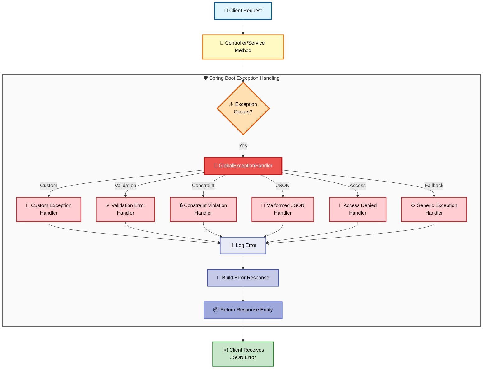

```mermaid
graph TB
    A[👤 Client Request] --> B[🎯 Controller/Service Method]
B --> C{⚠️ Exception<br/>Occurs?}

subgraph handler ["🛡️ Spring Boot Exception Handling"]
C -->|Yes| D[🔴 GlobalExceptionHandler]

D -->|Custom| E[📝 Custom Exception<br/>Handler]
D -->|Validation| F[✅ Validation Error<br/>Handler]
D -->|Constraint| G[🔒 Constraint Violation<br/>Handler]
D -->|JSON| H[📄 Malformed JSON<br/>Handler]
D -->|Access| I[🚫 Access Denied<br/>Handler]
D -->|Fallback| J[⚙️ Generic Exception<br/>Handler]

E --> K[📊 Log Error]
F --> K
G --> K
H --> K
I --> K
J --> K

K --> L[🔧 Build Error Response]
L --> M[📦 Return Response Entity]
end

M --> N[✉️ Client Receives<br/>JSON Error]

style A fill:#e1f5ff,stroke:#01579b,stroke-width:3px,color:#000
style B fill:#fff9c4,stroke:#f57f17,stroke-width:3px,color:#000
style C fill:#ffe0b2,stroke:#e65100,stroke-width:3px,color:#000
style D fill:#ef5350,stroke:#b71c1c,stroke-width:4px,color:#fff
style E fill:#ffcdd2,stroke:#c62828,stroke-width:2px,color:#000
style F fill:#ffcdd2,stroke:#c62828,stroke-width:2px,color:#000
style G fill:#ffcdd2,stroke:#c62828,stroke-width:2px,color:#000
style H fill:#ffcdd2,stroke:#c62828,stroke-width:2px,color:#000
style I fill:#ffcdd2,stroke:#c62828,stroke-width:2px,color:#000
style J fill:#ffcdd2,stroke:#c62828,stroke-width:2px,color:#000
style K fill:#e8eaf6,stroke:#3f51b5,stroke-width:2px,color:#000
style L fill:#c5cae9,stroke:#3f51b5,stroke-width:2px,color:#000
style M fill:#9fa8da,stroke:#3f51b5,stroke-width:2px,color:#000
style N fill:#c8e6c9,stroke:#2e7d32,stroke-width:3px,color:#000
style handler fill:#fafafa,stroke:#616161,stroke-width:2px
```