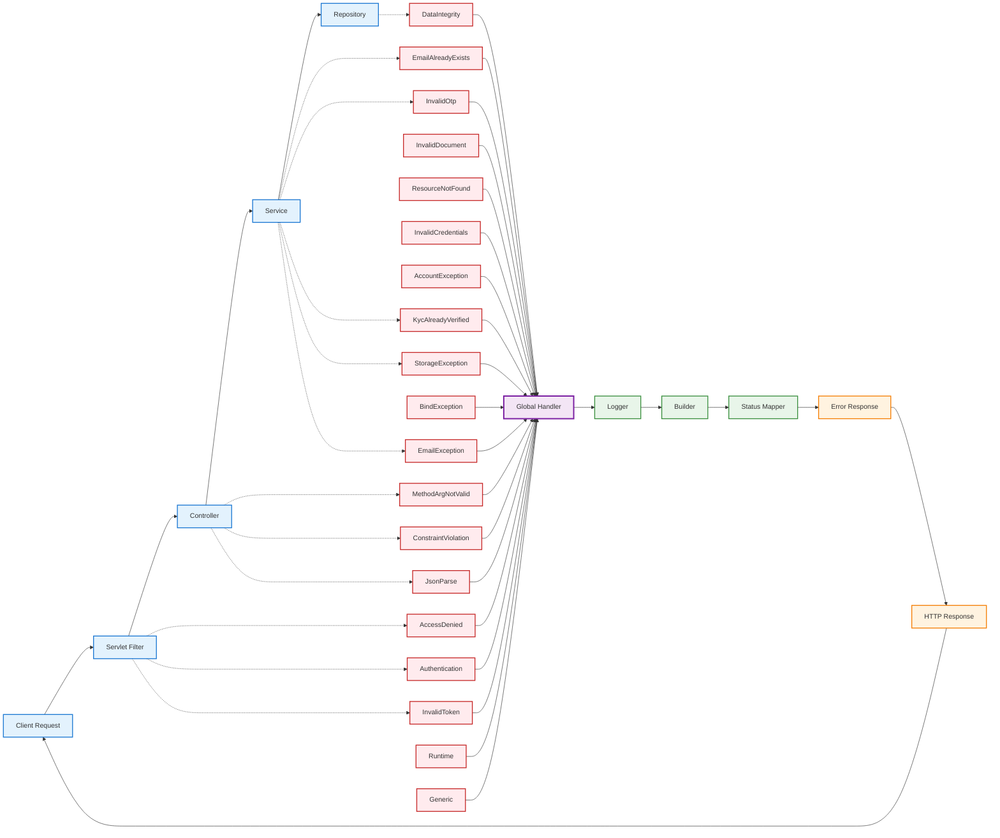

```mermaid
graph LR
    CLIENT[Client Request]
    FILTER[Servlet Filter]
    CONTROLLER[Controller]
    SERVICE[Service]
    REPOSITORY[Repository]

    EMAIL_EXISTS[EmailAlreadyExists]
    INVALID_OTP[InvalidOtp]
    KYC_VERIFIED[KycAlreadyVerified]
    INVALID_DOC[InvalidDocument]
    RESOURCE_NOT_FOUND[ResourceNotFound]
    INVALID_CREDS[InvalidCredentials]
    ACCOUNT_EX[AccountException]

    METHOD_ARG[MethodArgNotValid]
    CONSTRAINT[ConstraintViolation]
    BIND_EX[BindException]

    ACCESS_DENIED[AccessDenied]
    AUTH_EX[Authentication]
    INVALID_TOKEN[InvalidToken]

    STORAGE_EX[StorageException]
    EMAIL_EX[EmailException]
    SQL_EX[DataIntegrity]
    JSON_PARSE[JsonParse]

    RUNTIME[Runtime]
    GENERAL[Generic]

    GEH[Global Handler]
    
    LOG[Logger]
    BUILDER[Builder]
    STATUS[Status Mapper]
    
    ERROR_RESP[Error Response]
    HTTP_RESP[HTTP Response]

    CLIENT --> FILTER
    FILTER --> CONTROLLER
    CONTROLLER --> SERVICE
    SERVICE --> REPOSITORY

    REPOSITORY -.-> SQL_EX
    SERVICE -.-> EMAIL_EXISTS
    SERVICE -.-> INVALID_OTP
    SERVICE -.-> KYC_VERIFIED
    SERVICE -.-> STORAGE_EX
    SERVICE -.-> EMAIL_EX
    CONTROLLER -.-> METHOD_ARG
    CONTROLLER -.-> CONSTRAINT
    CONTROLLER -.-> JSON_PARSE
    FILTER -.-> ACCESS_DENIED
    FILTER -.-> AUTH_EX
    FILTER -.-> INVALID_TOKEN

    EMAIL_EXISTS --> GEH
    INVALID_OTP --> GEH
    KYC_VERIFIED --> GEH
    INVALID_DOC --> GEH
    RESOURCE_NOT_FOUND --> GEH
    INVALID_CREDS --> GEH
    ACCOUNT_EX --> GEH
    METHOD_ARG --> GEH
    CONSTRAINT --> GEH
    BIND_EX --> GEH
    ACCESS_DENIED --> GEH
    AUTH_EX --> GEH
    INVALID_TOKEN --> GEH
    STORAGE_EX --> GEH
    EMAIL_EX --> GEH
    SQL_EX --> GEH
    JSON_PARSE --> GEH
    RUNTIME --> GEH
    GENERAL --> GEH

    GEH --> LOG
    LOG --> BUILDER
    BUILDER --> STATUS
    STATUS --> ERROR_RESP
    ERROR_RESP --> HTTP_RESP
    HTTP_RESP --> CLIENT

    classDef requestStyle fill:#e3f2fd,stroke:#1976d2,stroke-width:2px
    classDef exceptionStyle fill:#ffebee,stroke:#c62828,stroke-width:2px
    classDef handlerStyle fill:#f3e5f5,stroke:#7b1fa2,stroke-width:3px
    classDef responseStyle fill:#e8f5e9,stroke:#388e3c,stroke-width:2px
    classDef outputStyle fill:#fff3e0,stroke:#f57c00,stroke-width:2px

    class CLIENT,FILTER,CONTROLLER,SERVICE,REPOSITORY requestStyle
    class EMAIL_EXISTS,INVALID_OTP,KYC_VERIFIED,INVALID_DOC,RESOURCE_NOT_FOUND,INVALID_CREDS,ACCOUNT_EX,METHOD_ARG,CONSTRAINT,BIND_EX,ACCESS_DENIED,AUTH_EX,INVALID_TOKEN,STORAGE_EX,EMAIL_EX,SQL_EX,JSON_PARSE,RUNTIME,GENERAL exceptionStyle
    class GEH handlerStyle
    class LOG,BUILDER,STATUS responseStyle
    class ERROR_RESP,HTTP_RESP outputStyle
```