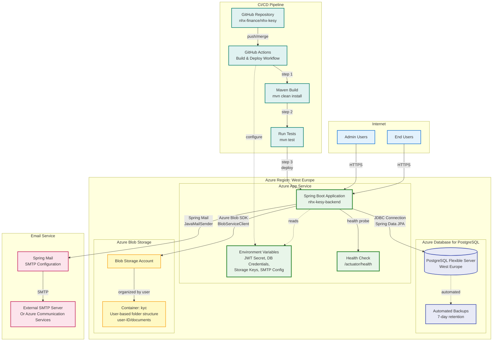

```mermaid
graph TB
    subgraph internet["Internet"]
        USER[End Users]
        ADMIN[Admin Users]
    end

    subgraph azure_region["Azure Region: West Europe"]
        subgraph app_service["Azure App Service"]
            APP[Spring Boot Application<br/>nhx-kesy-backend]
            ENV[Environment Variables<br/>JWT Secret, DB Credentials,<br/>Storage Keys, SMTP Config]
            HEALTH[Health Check<br/>/actuator/health]
        end

        subgraph database["Azure Database for PostgreSQL"]
            PG[(PostgreSQL Flexible Server<br/>West Europe)]
            PG_BACKUP[Automated Backups<br/>7-day retention]
        end

        subgraph storage["Azure Blob Storage"]
            BLOB[Blob Storage Account]
            KYC_CONTAINER["Container: kyc<br/>User-based folder structure<br/>user-ID/documents"]
        end
    end

    subgraph cicd["CI/CD Pipeline"]
        GIT[GitHub Repository<br/>nhx-finance/nhx-kesy]
        PIPELINE[GitHub Actions<br/>Build & Deploy Workflow]
        MVN[Maven Build<br/>mvn clean install]
        TEST[Run Tests<br/>mvn test]
    end

    subgraph smtp["Email Service"]
        MAIL[Spring Mail<br/>SMTP Configuration]
        SMTP_SERVER[External SMTP Server<br/>Or Azure Communication Services]
    end

    %% User Flow
    USER -->|HTTPS| APP
    ADMIN -->|HTTPS| APP

    %% App Service Configuration
    APP -.->|reads| ENV
    APP -->|health probe| HEALTH

    %% Database Connection
    APP -->|JDBC Connection<br/>Spring Data JPA| PG
    PG -.->|automated| PG_BACKUP

    %% Storage Access
    APP -->|Azure Blob SDK<br/>BlobServiceClient| BLOB
    BLOB -->|organized by user| KYC_CONTAINER

    %% Email Service
    APP -->|Spring Mail<br/>JavaMailSender| MAIL
    MAIL -->|SMTP| SMTP_SERVER

    %% CI/CD Flow
    GIT -->|push/merge| PIPELINE
    PIPELINE -->|step 1| MVN
    MVN -->|step 2| TEST
    TEST -->|step 3<br/>deploy| APP
    PIPELINE -.->|configure| ENV

    classDef userStyle fill:#e3f2fd,stroke:#1976d2,stroke-width:2px
    classDef azureStyle fill:#e8f5e9,stroke:#388e3c,stroke-width:3px
    classDef dataStyle fill:#e8eaf6,stroke:#3949ab,stroke-width:2px
    classDef storageStyle fill:#fff9c4,stroke:#f9a825,stroke-width:2px
    classDef cicdStyle fill:#e0f2f1,stroke:#00796b,stroke-width:2px
    classDef smtpStyle fill:#fce4ec,stroke:#c2185b,stroke-width:2px

    class USER,ADMIN userStyle
    class APP,ENV,HEALTH azureStyle
    class PG,PG_BACKUP dataStyle
    class BLOB,KYC_CONTAINER storageStyle
    class GIT,PIPELINE,MVN,TEST cicdStyle
    class MAIL,SMTP_SERVER smtpStyle
```