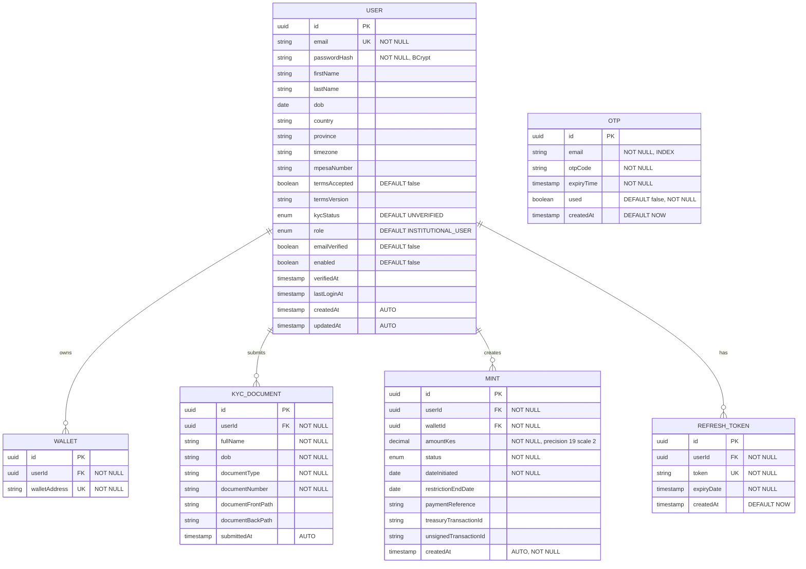

```mermaid
erDiagram
    USER ||--o{ WALLET : owns
    USER ||--o{ KYC_DOCUMENT : submits
    USER ||--o{ MINT : creates
    USER ||--o{ REFRESH_TOKEN : has

    USER {
        uuid id PK
        string email UK "NOT NULL"
        string passwordHash "NOT NULL, BCrypt"
        string firstName
        string lastName
        date dob
        string country
        string province
        string timezone
        string mpesaNumber
        boolean termsAccepted "DEFAULT false"
        string termsVersion
        enum kycStatus "DEFAULT UNVERIFIED"
        enum role "DEFAULT INSTITUTIONAL_USER"
        boolean emailVerified "DEFAULT false"
        boolean enabled "DEFAULT false"
        timestamp verifiedAt
        timestamp lastLoginAt
        timestamp createdAt "AUTO"
        timestamp updatedAt "AUTO"
    }

    WALLET {
        uuid id PK
        uuid userId FK "NOT NULL"
        string walletAddress UK "NOT NULL"
    }

    KYC_DOCUMENT {
        uuid id PK
        uuid userId FK "NOT NULL"
        string fullName "NOT NULL"
        string dob "NOT NULL"
        string documentType "NOT NULL"
        string documentNumber "NOT NULL"
        string documentFrontPath
        string documentBackPath
        timestamp submittedAt "AUTO"
    }

    MINT {
        uuid id PK
        uuid userId FK "NOT NULL"
        uuid walletId FK "NOT NULL"
        decimal amountKes "NOT NULL, precision 19 scale 2"
        enum status "NOT NULL"
        date dateInitiated "NOT NULL"
        date restrictionEndDate
        string paymentReference
        string treasuryTransactionId
        string unsignedTransactionId
        timestamp createdAt "AUTO, NOT NULL"
    }

    REFRESH_TOKEN {
        uuid id PK
        uuid userId FK "NOT NULL"
        string token UK "NOT NULL"
        timestamp expiryDate "NOT NULL"
        timestamp createdAt "DEFAULT NOW"
    }

    OTP {
        uuid id PK
        string email "NOT NULL, INDEX"
        string otpCode "NOT NULL"
        timestamp expiryTime "NOT NULL"
        boolean used "DEFAULT false, NOT NULL"
        timestamp createdAt "DEFAULT NOW"
    }
```