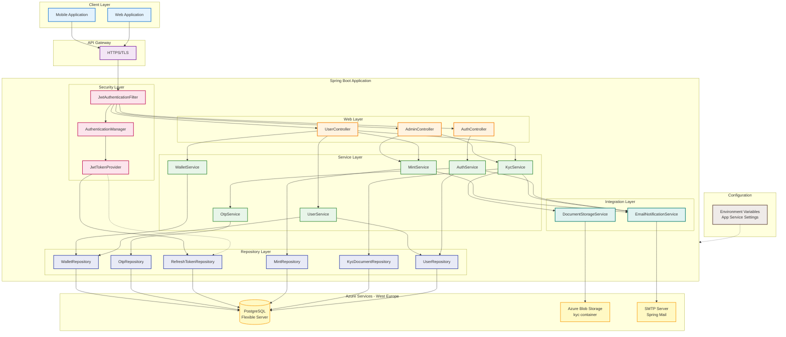

```mermaid
graph TB
    subgraph client[Client Layer]
        WEB[Web Application]
        MOBILE[Mobile Application]
    end

    subgraph gateway[API Gateway]
        HTTPS[HTTPS/TLS]
    end

    subgraph application[Spring Boot Application]
        subgraph web[Web Layer]
            AUTH_CTRL[AuthController]
            USER_CTRL[UserController]
            ADMIN_CTRL[AdminController]
        end

        subgraph security[Security Layer]
            JWT_FILTER[JwtAuthenticationFilter]
            AUTH_MGR[AuthenticationManager]
            JWT_PROVIDER[JwtTokenProvider]
        end

        subgraph service[Service Layer]
            AUTH_SVC[AuthService]
            KYC_SVC[KycService]
            MINT_SVC[MintService]
            USER_SVC[UserService]
            WALLET_SVC[WalletService]
            OTP_SVC[OtpService]
        end

        subgraph integration[Integration Layer]
            EMAIL_SVC[EmailNotificationService]
            STORAGE_SVC[DocumentStorageService]
        end

        subgraph persistence[Repository Layer]
            USER_REPO[UserRepository]
            KYC_REPO[KycDocumentRepository]
            MINT_REPO[MintRepository]
            TOKEN_REPO[RefreshTokenRepository]
            OTP_REPO[OtpRepository]
            WALLET_REPO[WalletRepository]
        end
    end

    subgraph azure[Azure Services - West Europe]
        DATABASE[(PostgreSQL<br/>Flexible Server)]
        BLOB[Azure Blob Storage<br/>kyc container]
        SMTP[SMTP Server<br/>Spring Mail]
    end

    subgraph config[Configuration]
        ENV[Environment Variables<br/>App Service Settings]
    end

    %% Client to Gateway
    WEB --> HTTPS
    MOBILE --> HTTPS

    %% Gateway to Application
    HTTPS --> JWT_FILTER

    %% Security Flow
    JWT_FILTER --> AUTH_MGR
    JWT_FILTER --> AUTH_CTRL
    JWT_FILTER --> USER_CTRL
    JWT_FILTER --> ADMIN_CTRL
    
    AUTH_MGR --> JWT_PROVIDER
    JWT_PROVIDER -.-> TOKEN_REPO

    %% Controller to Service
    AUTH_CTRL --> AUTH_SVC
    USER_CTRL --> USER_SVC
    USER_CTRL --> KYC_SVC
    USER_CTRL --> MINT_SVC
    USER_CTRL --> WALLET_SVC
    ADMIN_CTRL --> KYC_SVC
    ADMIN_CTRL --> MINT_SVC

    %% Service to Integration
    AUTH_SVC --> OTP_SVC
    AUTH_SVC --> EMAIL_SVC
    KYC_SVC --> STORAGE_SVC
    KYC_SVC --> EMAIL_SVC
    MINT_SVC --> EMAIL_SVC

    %% Service to Repository
    AUTH_SVC --> USER_REPO
    USER_SVC --> USER_REPO
    USER_SVC --> WALLET_REPO
    WALLET_SVC --> WALLET_REPO
    KYC_SVC --> KYC_REPO
    MINT_SVC --> MINT_REPO
    OTP_SVC --> OTP_REPO
    JWT_PROVIDER --> TOKEN_REPO

    %% Repository to Database
    USER_REPO --> DATABASE
    KYC_REPO --> DATABASE
    MINT_REPO --> DATABASE
    TOKEN_REPO --> DATABASE
    OTP_REPO --> DATABASE
    WALLET_REPO --> DATABASE

    %% Integration to External
    STORAGE_SVC --> BLOB
    EMAIL_SVC --> SMTP

    %% Configuration
    ENV -.-> application

    classDef clientStyle fill:#e3f2fd,stroke:#1976d2,stroke-width:2px
    classDef gatewayStyle fill:#f3e5f5,stroke:#7b1fa2,stroke-width:2px
    classDef webStyle fill:#fff3e0,stroke:#f57c00,stroke-width:2px
    classDef securityStyle fill:#fce4ec,stroke:#c2185b,stroke-width:2px
    classDef serviceStyle fill:#e8f5e9,stroke:#388e3c,stroke-width:2px
    classDef integrationStyle fill:#e0f2f1,stroke:#00796b,stroke-width:2px
    classDef dataStyle fill:#e8eaf6,stroke:#3949ab,stroke-width:2px
    classDef azureStyle fill:#fff9c4,stroke:#f9a825,stroke-width:2px
    classDef configStyle fill:#efebe9,stroke:#5d4037,stroke-width:2px

    class WEB,MOBILE clientStyle
    class HTTPS gatewayStyle
    class AUTH_CTRL,USER_CTRL,ADMIN_CTRL webStyle
    class JWT_FILTER,AUTH_MGR,JWT_PROVIDER securityStyle
    class AUTH_SVC,KYC_SVC,MINT_SVC,USER_SVC,WALLET_SVC,OTP_SVC serviceStyle
    class EMAIL_SVC,STORAGE_SVC integrationStyle
    class USER_REPO,KYC_REPO,MINT_REPO,TOKEN_REPO,OTP_REPO,WALLET_REPO dataStyle
    class DATABASE,BLOB,SMTP azureStyle
    class ENV configStyle
```