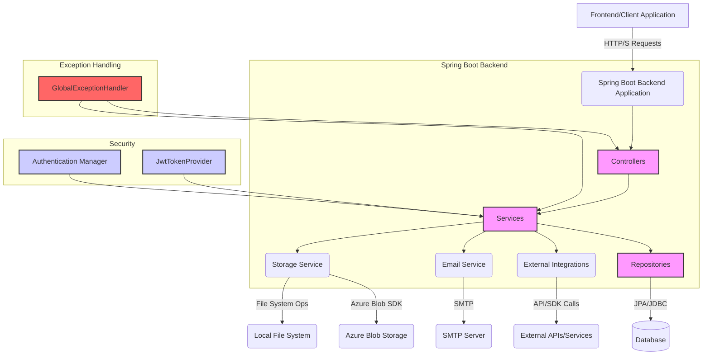

```mermaid
graph TD
    A[Frontend/Client Application] -->|HTTP/S Requests| B(Spring Boot Backend Application)

    subgraph "Spring Boot Backend"
        B --> C[Controllers]
        C --> D[Services]
        D --> E[Repositories]
        D --> F(External Integrations)
        D --> G(Email Service)
        D --> H(Storage Service)
    end

    E -->|JPA/JDBC| I[(Database)]
    F -->|API/SDK Calls| J(External APIs/Services)
    G -->|SMTP| K(SMTP Server)
    H -->|Azure Blob SDK| L(Azure Blob Storage)
    H -->|File System Ops| M(Local File System)

    subgraph Security
        N[Authentication Manager] --> D
        O[JwtTokenProvider] --> D
    end

    subgraph "Exception Handling"
        P[GlobalExceptionHandler] --> C
        P --> D
    end

    style C fill:#f9f,stroke:#333,stroke-width:2px
    style D fill:#f9f,stroke:#333,stroke-width:2px
    style E fill:#f9f,stroke:#333,stroke-width:2px
    style N fill:#ccf,stroke:#333,stroke-width:2px
    style O fill:#ccf,stroke:#333,stroke-width:2px
    style P fill:#f66,stroke:#333,stroke-width:2px
```