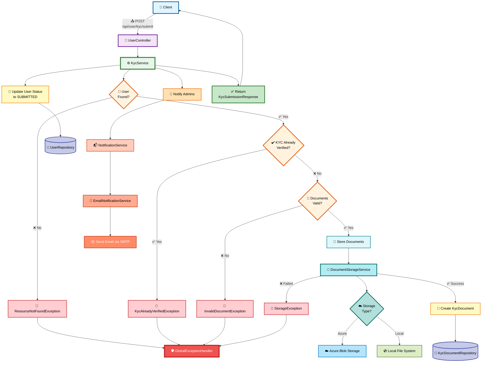

```mermaid
graph TB
    A[👤 Client] -->|📤 POST<br/>/api/user/kyc/submit| B[🎯 UserController]
B --> C[⚙️ KycService]

C --> D{👤 User<br/>Found?}
D -->|❌ No| E[🚨 ResourceNotFoundException]
E --> J[🛡️ GlobalExceptionHandler]

D -->|✅ Yes| F{✔️ KYC Already<br/>Verified?}
F -->|✅ Yes| G[🚨 KycAlreadyVerifiedException]
G --> J

F -->|❌ No| H{📄 Documents<br/>Valid?}
H -->|❌ No| I[🚨 InvalidDocumentException]
I --> J

H -->|✅ Yes| K[💾 Store Documents]
K --> L[📁 DocumentStorageService]
L --> M{☁️ Storage<br/>Type?}

M -->|Azure| N1[☁️ Azure Blob Storage]
M -->|Local| N2[💿 Local File System]

L -->|❌ Failed| O[🚨 StorageException]
O --> J

L -->|✅ Success| P[📝 Create KycDocument]
P --> Q[(💾 KycDocumentRepository)]

C --> R[🔄 Update User Status<br/>to SUBMITTED]
R --> S[(👥 UserRepository)]

C --> T[📧 Notify Admins]
T --> U[📬 NotificationService]
U --> V[📮 EmailNotificationService]
V --> W[✉️ Send Email via SMTP]

C --> X[✅ Return<br/>KycSubmissionResponse]
X --> A

style A fill:#e1f5ff,stroke:#01579b,stroke-width:3px,color:#000
style B fill:#f3e5f5,stroke:#6a1b9a,stroke-width:3px,color:#000
style C fill:#e8f5e9,stroke:#2e7d32,stroke-width:4px,color:#000
style D fill:#fff3e0,stroke:#e65100,stroke-width:3px,color:#000
style E fill:#ffcdd2,stroke:#c62828,stroke-width:2px,color:#000
style F fill:#fff3e0,stroke:#e65100,stroke-width:3px,color:#000
style G fill:#ffcdd2,stroke:#c62828,stroke-width:2px,color:#000
style H fill:#fff3e0,stroke:#e65100,stroke-width:3px,color:#000
style I fill:#ffcdd2,stroke:#c62828,stroke-width:2px,color:#000
style J fill:#ef5350,stroke:#b71c1c,stroke-width:4px,color:#fff
style K fill:#e0f7fa,stroke:#00838f,stroke-width:2px,color:#000
style L fill:#b2ebf2,stroke:#00695c,stroke-width:3px,color:#000
style M fill:#b2dfdb,stroke:#00695c,stroke-width:3px,color:#000
style N1 fill:#b3e5fc,stroke:#0277bd,stroke-width:2px,color:#000
style N2 fill:#dcedc8,stroke:#558b2f,stroke-width:2px,color:#000
style O fill:#ffcdd2,stroke:#c62828,stroke-width:2px,color:#000
style P fill:#fff9c4,stroke:#f57f17,stroke-width:2px,color:#000
style Q fill:#c5cae9,stroke:#283593,stroke-width:2px,color:#000
style R fill:#fff9c4,stroke:#f57f17,stroke-width:2px,color:#000
style S fill:#c5cae9,stroke:#283593,stroke-width:2px,color:#000
style T fill:#ffe0b2,stroke:#ef6c00,stroke-width:2px,color:#000
style U fill:#ffccbc,stroke:#d84315,stroke-width:2px,color:#000
style V fill:#ffab91,stroke:#bf360c,stroke-width:2px,color:#000
style W fill:#ff8a65,stroke:#bf360c,stroke-width:2px,color:#fff
style X fill:#c8e6c9,stroke:#2e7d32,stroke-width:3px,color:#000
```

```mermaid
sequenceDiagram
    participant C as Client
    participant UC as UserController
    participant MS as MintService
    participant US as UserService
    participant WS as WalletService
    participant NS as NotificationService
    participant MR as MintRequestRepository
    participant WR as WalletRepository
    participant UR as UserRepository
    participant SM as SMTP Server
    participant BC as Blockchain Service
    participant EH as ExceptionHandler

    rect rgb(232, 245, 233)
    Note over C,BC: User Mint Request Submission
    C->>+UC: POST /api/user/mints + JWT
    UC->>UC: validateRequest(amount, walletId)
    
    alt Invalid Amount
        UC->>EH: throw InvalidAmountException
        EH-->>C: 400 BAD_REQUEST
    end
    
    UC->>+MS: createMintRequest(userId, request)
    MS->>+US: getUserById(userId)
    US->>+UR: findById(userId)
    
    alt User Not Found
        UR-->>-US: empty
        US->>EH: throw ResourceNotFoundException
        EH-->>C: 404 NOT_FOUND
    end
    
    UR-->>US: User
    US-->>-MS: User
    
    alt KYC Not Verified
        MS->>MS: checkKycStatus(user)
        MS->>EH: throw KycNotVerifiedException
        EH-->>C: 403 FORBIDDEN
    end
    
    MS->>+WS: getWalletById(walletId)
    WS->>+WR: findById(walletId)
    
    alt Wallet Not Found
        WR-->>-WS: empty
        WS->>EH: throw ResourceNotFoundException
        EH-->>C: 404 NOT_FOUND
    end
    
    WR-->>WS: Wallet
    WS-->>-MS: Wallet
    
    alt Wallet Not Owned By User
        MS->>MS: validateOwnership(wallet, userId)
        MS->>EH: throw UnauthorizedAccessException
        EH-->>C: 403 FORBIDDEN
    end
    
    MS->>MS: calculateFees(amount)
    MS->>MS: validateBusinessRules(amount, user)
    
    MS->>+MR: save(mintRequest)
    MR-->>-MS: MintRequest
    
    MS->>+NS: notifyAdminNewMintRequest(user, request)
    NS->>+SM: sendEmail(adminEmail, subject, template)
    SM-->>-NS: emailSent
    NS-->>-MS: notificationSent
    
    MS->>+NS: notifyUserMintRequestReceived(user, request)
    NS->>+SM: sendEmail(userEmail, subject, template)
    SM-->>-NS: emailSent
    NS-->>-MS: notificationSent
    
    MS-->>-UC: MintRequestResponse
    UC-->>-C: 201 CREATED + request details
    end

    rect rgb(227, 242, 253)
    Note over C,BC: Admin Mint Request Review
    C->>+UC: GET /api/admin/mints + Admin JWT
    UC->>+MS: getAllMintRequests(filters, pagination)
    MS->>+MR: findAll(specification, pageable)
    MR-->>-MS: Page<MintRequest>
    MS-->>-UC: Page<MintRequestDto>
    UC-->>-C: 200 OK + paginated requests
    end

    rect rgb(255, 243, 224)
    Note over C,BC: Admin Approve Mint Request
    C->>+UC: PATCH /api/admin/mints/{id}/status + Admin JWT
    UC->>+MS: updateMintStatus(mintId, APPROVED, adminId)
    MS->>+MR: findById(mintId)
    
    alt Mint Request Not Found
        MR-->>-MS: empty
        MS->>EH: throw ResourceNotFoundException
        EH-->>C: 404 NOT_FOUND
    end
    
    MR-->>MS: MintRequest
    MS->>MS: validateStatusTransition(currentStatus, newStatus)
    
    alt Invalid Status Transition
        MS->>EH: throw InvalidStatusTransitionException
        EH-->>C: 400 BAD_REQUEST
    end
    
    MS->>MR: updateStatus(mintId, APPROVED, adminId)
    
    MS->>+BC: initiateMintTransaction(request)
    BC->>BC: buildTransaction(amount, walletAddress)
    BC->>BC: signTransaction(privateKey)
    BC->>BC: broadcastTransaction()
    
    alt Blockchain Error
        BC-->>-MS: BlockchainException
        MS->>MR: updateStatus(mintId, FAILED, error)
        MS->>EH: throw BlockchainException
        EH-->>C: 500 INTERNAL_SERVER_ERROR
    else Transaction Broadcast Success
        BC-->>MS: txHash
        MS->>MR: updateTransactionHash(mintId, txHash)
        MS->>MR: updateStatus(mintId, PROCESSING)
    end
    
    MS->>+NS: notifyUserMintApproved(user, request, txHash)
    NS->>+SM: sendEmail(userEmail, subject, template)
    SM-->>-NS: emailSent
    NS-->>-MS: notificationSent
    
    MS-->>-UC: MintStatusUpdateResponse
    UC-->>-C: 200 OK + updated status
    end

    rect rgb(255, 235, 238)
    Note over C,BC: Admin Reject Mint Request
    C->>+UC: PATCH /api/admin/mints/{id}/status + Admin JWT
    UC->>+MS: updateMintStatus(mintId, REJECTED, adminId, reason)
    MS->>+MR: findById(mintId)
    MR-->>-MS: MintRequest
    
    MS->>MR: updateStatus(mintId, REJECTED, adminId, reason)
    
    MS->>+NS: notifyUserMintRejected(user, request, reason)
    NS->>+SM: sendEmail(userEmail, subject, template)
    SM-->>-NS: emailSent
    NS-->>-MS: notificationSent
    
    MS-->>-UC: MintStatusUpdateResponse
    UC-->>-C: 200 OK + rejection details
    end

    rect rgb(243, 229, 245)
    Note over BC,MS: Blockchain Transaction Confirmation (Async)
    BC->>BC: pollTransactionStatus(txHash)
    BC->>BC: waitForConfirmations(minConfirmations)
    
    alt Transaction Confirmed
        BC->>+MS: handleTransactionConfirmed(txHash, blockNumber)
        MS->>MR: updateStatus(mintId, COMPLETED, blockNumber)
        MS->>+NS: notifyUserMintCompleted(user, request)
        NS->>SM: sendEmail(userEmail, subject, template)
        NS-->>-MS: notificationSent
        MS-->>-BC: acknowledged
    else Transaction Failed
        BC->>+MS: handleTransactionFailed(txHash, error)
        MS->>MR: updateStatus(mintId, FAILED, error)
        MS->>+NS: notifyUserMintFailed(user, request, error)
        NS->>SM: sendEmail(userEmail, subject, template)
        NS-->>-MS: notificationSent
        MS-->>-BC: acknowledged
    end
    end 
```