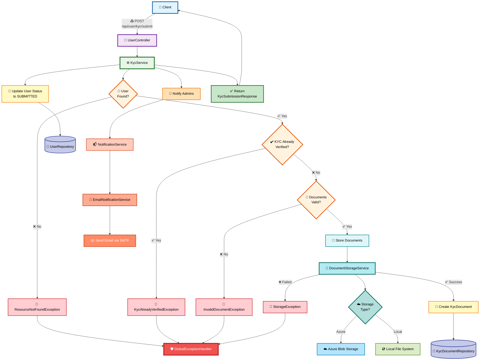

```mermaid
graph TB
    A[👤 Client] -->|📤 POST<br/>/api/user/kyc/submit| B[🎯 UserController]
B --> C[⚙️ KycService]

C --> D{👤 User<br/>Found?}
D -->|❌ No| E[🚨 ResourceNotFoundException]
E --> J[🛡️ GlobalExceptionHandler]

D -->|✅ Yes| F{✔️ KYC Already<br/>Verified?}
F -->|✅ Yes| G[🚨 KycAlreadyVerifiedException]
G --> J

F -->|❌ No| H{📄 Documents<br/>Valid?}
H -->|❌ No| I[🚨 InvalidDocumentException]
I --> J

H -->|✅ Yes| K[💾 Store Documents]
K --> L[📁 DocumentStorageService]
L --> M{☁️ Storage<br/>Type?}

M -->|Azure| N1[☁️ Azure Blob Storage]
M -->|Local| N2[💿 Local File System]

L -->|❌ Failed| O[🚨 StorageException]
O --> J

L -->|✅ Success| P[📝 Create KycDocument]
P --> Q[(💾 KycDocumentRepository)]

C --> R[🔄 Update User Status<br/>to SUBMITTED]
R --> S[(👥 UserRepository)]

C --> T[📧 Notify Admins]
T --> U[📬 NotificationService]
U --> V[📮 EmailNotificationService]
V --> W[✉️ Send Email via SMTP]

C --> X[✅ Return<br/>KycSubmissionResponse]
X --> A

style A fill:#e1f5ff,stroke:#01579b,stroke-width:3px,color:#000
style B fill:#f3e5f5,stroke:#6a1b9a,stroke-width:3px,color:#000
style C fill:#e8f5e9,stroke:#2e7d32,stroke-width:4px,color:#000
style D fill:#fff3e0,stroke:#e65100,stroke-width:3px,color:#000
style E fill:#ffcdd2,stroke:#c62828,stroke-width:2px,color:#000
style F fill:#fff3e0,stroke:#e65100,stroke-width:3px,color:#000
style G fill:#ffcdd2,stroke:#c62828,stroke-width:2px,color:#000
style H fill:#fff3e0,stroke:#e65100,stroke-width:3px,color:#000
style I fill:#ffcdd2,stroke:#c62828,stroke-width:2px,color:#000
style J fill:#ef5350,stroke:#b71c1c,stroke-width:4px,color:#fff
style K fill:#e0f7fa,stroke:#00838f,stroke-width:2px,color:#000
style L fill:#b2ebf2,stroke:#00695c,stroke-width:3px,color:#000
style M fill:#b2dfdb,stroke:#00695c,stroke-width:3px,color:#000
style N1 fill:#b3e5fc,stroke:#0277bd,stroke-width:2px,color:#000
style N2 fill:#dcedc8,stroke:#558b2f,stroke-width:2px,color:#000
style O fill:#ffcdd2,stroke:#c62828,stroke-width:2px,color:#000
style P fill:#fff9c4,stroke:#f57f17,stroke-width:2px,color:#000
style Q fill:#c5cae9,stroke:#283593,stroke-width:2px,color:#000
style R fill:#fff9c4,stroke:#f57f17,stroke-width:2px,color:#000
style S fill:#c5cae9,stroke:#283593,stroke-width:2px,color:#000
style T fill:#ffe0b2,stroke:#ef6c00,stroke-width:2px,color:#000
style U fill:#ffccbc,stroke:#d84315,stroke-width:2px,color:#000
style V fill:#ffab91,stroke:#bf360c,stroke-width:2px,color:#000
style W fill:#ff8a65,stroke:#bf360c,stroke-width:2px,color:#fff
style X fill:#c8e6c9,stroke:#2e7d32,stroke-width:3px,color:#000
```
