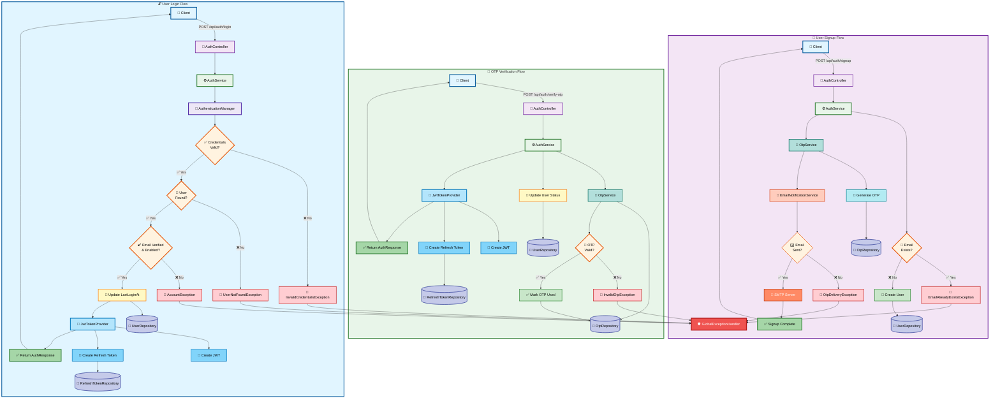

```mermaid
graph TB
subgraph signup ["📝 User Signup Flow"]
A1[👤 Client] -->|POST /api/auth/signup| B1[🎯 AuthController]
B1 --> C1[⚙️ AuthService]
C1 --> D1{📧 Email<br/>Exists?}
D1 -->|✅ Yes| E1[🚨 EmailAlreadyExistsException]
E1 --> X[🛡️ GlobalExceptionHandler]

D1 -->|❌ No| F1[👤 Create User]
F1 --> G1[(💾 UserRepository)]

C1 --> H1[🔐 OtpService]
H1 --> I1[🔑 Generate OTP]
I1 --> J1[(💾 OtpRepository)]

H1 --> K1[📧 EmailNotificationService]
K1 --> L1{✉️ Email<br/>Sent?}
L1 -->|❌ No| M1[🚨 OtpDeliveryException]
M1 --> X
L1 -->|✅ Yes| N1[📮 SMTP Server]
N1 --> O1[✅ Signup Complete]
O1 --> A1
end

subgraph verify ["🔐 OTP Verification Flow"]
A2[👤 Client] -->|POST /api/auth/verify-otp| B2[🎯 AuthController]
B2 --> C2[⚙️ AuthService]
C2 --> D2[🔐 OtpService]
D2 --> E2[(💾 OtpRepository)]

D2 --> F2{🔑 OTP<br/>Valid?}
F2 -->|❌ No| G2[🚨 InvalidOtpException]
G2 --> X

F2 -->|✅ Yes| H2[✅ Mark OTP Used]
H2 --> E2

C2 --> I2[📝 Update User Status]
I2 --> J2[(👥 UserRepository)]

C2 --> K2[🎫 JwtTokenProvider]
K2 --> L2[🔑 Create JWT]
K2 --> M2[🔄 Create Refresh Token]
M2 --> N2[(💾 RefreshTokenRepository)]

K2 --> O2[✅ Return AuthResponse]
O2 --> A2
end

subgraph login ["🔓 User Login Flow"]
A3[👤 Client] -->|POST /api/auth/login| B3[🎯 AuthController]
B3 --> C3[⚙️ AuthService]
C3 --> D3[🔐 AuthenticationManager]

D3 --> E3{✅ Credentials<br/>Valid?}
E3 -->|❌ No| F3[🚨 InvalidCredentialsException]
F3 --> X

E3 -->|✅ Yes| G3{👤 User<br/>Found?}
G3 -->|❌ No| H3[🚨 UserNotFoundException]
H3 --> X

G3 -->|✅ Yes| I3{✔️ Email Verified<br/>& Enabled?}
I3 -->|❌ No| J3[🚨 AccountException]
J3 --> X

I3 -->|✅ Yes| K3[📝 Update LastLoginAt]
K3 --> L3[(👥 UserRepository)]

K3 --> M3[🎫 JwtTokenProvider]
M3 --> N3[🔑 Create JWT]
M3 --> O3[🔄 Create Refresh Token]
O3 --> P3[(💾 RefreshTokenRepository)]

M3 --> Q3[✅ Return AuthResponse]
Q3 --> A3
end

style A1 fill:#e1f5ff,stroke:#01579b,stroke-width:3px,color:#000
style B1 fill:#f3e5f5,stroke:#6a1b9a,stroke-width:2px,color:#000
style C1 fill:#e8f5e9,stroke:#2e7d32,stroke-width:3px,color:#000
style D1 fill:#fff3e0,stroke:#e65100,stroke-width:3px,color:#000
style E1 fill:#ffcdd2,stroke:#c62828,stroke-width:2px,color:#000
style F1 fill:#c8e6c9,stroke:#388e3c,stroke-width:2px,color:#000
style G1 fill:#c5cae9,stroke:#283593,stroke-width:2px,color:#000
style H1 fill:#b2dfdb,stroke:#00695c,stroke-width:2px,color:#000
style I1 fill:#b2ebf2,stroke:#00838f,stroke-width:2px,color:#000
style J1 fill:#c5cae9,stroke:#283593,stroke-width:2px,color:#000
style K1 fill:#ffccbc,stroke:#d84315,stroke-width:2px,color:#000
style L1 fill:#fff3e0,stroke:#e65100,stroke-width:2px,color:#000
style M1 fill:#ffcdd2,stroke:#c62828,stroke-width:2px,color:#000
style N1 fill:#ff8a65,stroke:#bf360c,stroke-width:2px,color:#fff
style O1 fill:#a5d6a7,stroke:#2e7d32,stroke-width:3px,color:#000

style A2 fill:#e1f5ff,stroke:#01579b,stroke-width:3px,color:#000
style B2 fill:#f3e5f5,stroke:#6a1b9a,stroke-width:2px,color:#000
style C2 fill:#e8f5e9,stroke:#2e7d32,stroke-width:3px,color:#000
style D2 fill:#b2dfdb,stroke:#00695c,stroke-width:2px,color:#000
style E2 fill:#c5cae9,stroke:#283593,stroke-width:2px,color:#000
style F2 fill:#fff3e0,stroke:#e65100,stroke-width:3px,color:#000
style G2 fill:#ffcdd2,stroke:#c62828,stroke-width:2px,color:#000
style H2 fill:#c8e6c9,stroke:#388e3c,stroke-width:2px,color:#000
style I2 fill:#fff9c4,stroke:#f57f17,stroke-width:2px,color:#000
style J2 fill:#c5cae9,stroke:#283593,stroke-width:2px,color:#000
style K2 fill:#b3e5fc,stroke:#0277bd,stroke-width:3px,color:#000
style L2 fill:#81d4fa,stroke:#0277bd,stroke-width:2px,color:#000
style M2 fill:#81d4fa,stroke:#0277bd,stroke-width:2px,color:#000
style N2 fill:#c5cae9,stroke:#283593,stroke-width:2px,color:#000
style O2 fill:#a5d6a7,stroke:#2e7d32,stroke-width:3px,color:#000

style A3 fill:#e1f5ff,stroke:#01579b,stroke-width:3px,color:#000
style B3 fill:#f3e5f5,stroke:#6a1b9a,stroke-width:2px,color:#000
style C3 fill:#e8f5e9,stroke:#2e7d32,stroke-width:3px,color:#000
style D3 fill:#ede7f6,stroke:#512da8,stroke-width:3px,color:#000
style E3 fill:#fff3e0,stroke:#e65100,stroke-width:3px,color:#000
style F3 fill:#ffcdd2,stroke:#c62828,stroke-width:2px,color:#000
style G3 fill:#fff3e0,stroke:#e65100,stroke-width:3px,color:#000
style H3 fill:#ffcdd2,stroke:#c62828,stroke-width:2px,color:#000
style I3 fill:#fff3e0,stroke:#e65100,stroke-width:3px,color:#000
style J3 fill:#ffcdd2,stroke:#c62828,stroke-width:2px,color:#000
style K3 fill:#fff9c4,stroke:#f57f17,stroke-width:2px,color:#000
style L3 fill:#c5cae9,stroke:#283593,stroke-width:2px,color:#000
style M3 fill:#b3e5fc,stroke:#0277bd,stroke-width:3px,color:#000
style N3 fill:#81d4fa,stroke:#0277bd,stroke-width:2px,color:#000
style O3 fill:#81d4fa,stroke:#0277bd,stroke-width:2px,color:#000
style P3 fill:#c5cae9,stroke:#283593,stroke-width:2px,color:#000
style Q3 fill:#a5d6a7,stroke:#2e7d32,stroke-width:3px,color:#000

style X fill:#ef5350,stroke:#b71c1c,stroke-width:4px,color:#fff

style signup fill:#f3e5f5,stroke:#6a1b9a,stroke-width:3px
style verify fill:#e8f5e9,stroke:#2e7d32,stroke-width:3px
style login fill:#e1f5ff,stroke:#01579b,stroke-width:3px
```