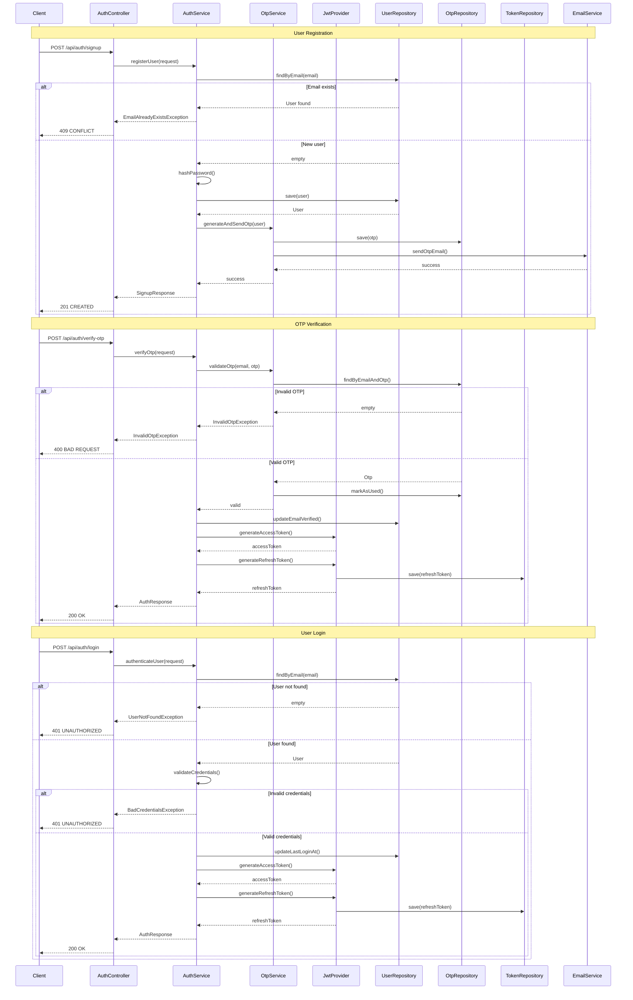

```mermaid
sequenceDiagram
    participant C as Client
    participant AC as AuthController
    participant AS as AuthService
    participant OS as OtpService
    participant JP as JwtProvider
    participant UR as UserRepository
    participant OR as OtpRepository
    participant TR as TokenRepository
    participant ES as EmailService

    Note over C,ES: User Registration
    C->>AC: POST /api/auth/signup
    AC->>AS: registerUser(request)
    AS->>UR: findByEmail(email)
    
    alt Email exists
        UR-->>AS: User found
        AS-->>AC: EmailAlreadyExistsException
        AC-->>C: 409 CONFLICT
    else New user
        UR-->>AS: empty
        AS->>AS: hashPassword()
        AS->>UR: save(user)
        UR-->>AS: User
        AS->>OS: generateAndSendOtp(user)
        OS->>OR: save(otp)
        OS->>ES: sendOtpEmail()
        ES-->>OS: success
        OS-->>AS: success
        AS-->>AC: SignupResponse
        AC-->>C: 201 CREATED
    end

    Note over C,ES: OTP Verification
    C->>AC: POST /api/auth/verify-otp
    AC->>AS: verifyOtp(request)
    AS->>OS: validateOtp(email, otp)
    OS->>OR: findByEmailAndOtp()
    
    alt Invalid OTP
        OR-->>OS: empty
        OS-->>AS: InvalidOtpException
        AS-->>AC: InvalidOtpException
        AC-->>C: 400 BAD REQUEST
    else Valid OTP
        OR-->>OS: Otp
        OS->>OR: markAsUsed()
        OS-->>AS: valid
        AS->>UR: updateEmailVerified()
        AS->>JP: generateAccessToken()
        JP-->>AS: accessToken
        AS->>JP: generateRefreshToken()
        JP->>TR: save(refreshToken)
        JP-->>AS: refreshToken
        AS-->>AC: AuthResponse
        AC-->>C: 200 OK
    end

    Note over C,ES: User Login
    C->>AC: POST /api/auth/login
    AC->>AS: authenticateUser(request)
    AS->>UR: findByEmail(email)
    
    alt User not found
        UR-->>AS: empty
        AS-->>AC: UserNotFoundException
        AC-->>C: 401 UNAUTHORIZED
    else User found
        UR-->>AS: User
        AS->>AS: validateCredentials()
        
        alt Invalid credentials
            AS-->>AC: BadCredentialsException
            AC-->>C: 401 UNAUTHORIZED
        else Valid credentials
            AS->>UR: updateLastLoginAt()
            AS->>JP: generateAccessToken()
            JP-->>AS: accessToken
            AS->>JP: generateRefreshToken()
            JP->>TR: save(refreshToken)
            JP-->>AS: refreshToken
            AS-->>AC: AuthResponse
            AC-->>C: 200 OK
        end
    end
```